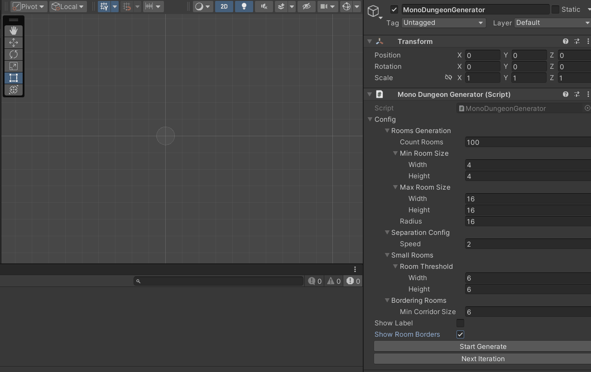

# HammerRPG

Проект шаблон/игра.  
Гибкая процедурная генерация данжа.  
Самописный DI через рефлекцию.  
Универсальная модульная система предметов.  
И другие модули для работы с датой, ассетами, таймерами и тд.

Где что:
Assets/App
+ /Common - шаблонный код
+ /Game - код основной игры, сейчас там мало чего написано, нечего смотреть
+ /Generation - код генерации данжа, завершен, можно посмотреть

## DI - Autumn
[Assets/App/Common/Autumn](https://github.com/gunter0216/HammerRPG/tree/master/Assets/App/Common/Autumn)  

### Scoped
Помечаем класс аттрибутов Scoped и экземпляр класса добавится в di. В качестве параметра передаётся контекст, в данном случае это сцена. 
```
[Scoped(typeof(GameSceneContext))]
public class GameItemsManager
{
  ...
}
```

### Inject
Помечаются поля класса в которые заинжектятся экземпляры.
Можно инжектить по интерфейсу, конкретный экзампляр и список
```
[Scoped(typeof(GameSceneContext))]
public class ModuleItemsManager
{
  [Inject] private readonly IContainersDataManager m_ContainersDataManager;
  [Inject] private readonly List<IModuleDtoToConfigConverter> m_ModuleDtoToConfigConverters;
  [Inject] private readonly Logger m_Logger;
}
```

### Singleton
Помечаются классы, которые должны существовать всё время.
```
[Singleton]
public class ContainersDataManagerProxy : IContainersDataManager
{
}
```

## Универсальня модульная система предметов, что это?  
<b>Проблема</b>: есть инвентарь. Как положить туда абсолютно разное... всё, не меняя код при добавлении нового типа (броня, карточки для гвинта, заклинание)  
<b>Решение</b>: в дате инвентаря, хранить только список ссылок на предметы. Ссылка выглядит примерно так
```
public class DataReference
{
  public string Key => m_Key; // id контейнера, в котором лежат конкретные экземпляры
  public int Index => m_Index; // индекс элемента в списке контейнера

  ...
}
```
<b>Проблема</b>: есть оружие. Хочу добавить ему зачарование. Для зачарования нужна дата. Все даты зачарований уникальны и изменяются. Как не хранить в дате предмета список дат-интерфейсов для зачарований. (потому что они плохо парсятся)  
<b>Решение</b>: хранить в дате предмета, список ссылок на даты зачарований  
```
public class ModuleItemData
{
  public string Id => m_Id; // id предмета
  public List<DataReference> ModuleRefs => m_ModuleRefs; // список ссылок на даты модулей
  ...
}
```

[Assets/App/Common/Data](https://github.com/gunter0216/HammerRPG/tree/master/Assets/App/Common/Data) - DataManager, который сохраняет дату  
[Assets/App/Common/DataContainer](https://github.com/gunter0216/HammerRPG/tree/master/Assets/App/Common/DataContainer) - Контейнеры дат. Те самые ссылки на дату.   
[Assets/App/Common/ModuleItem](https://github.com/gunter0216/HammerRPG/tree/master/Assets/App/Common/ModuleItem) - Модульные предметы  
[Assets/App/Game/GameItems](https://github.com/gunter0216/HammerRPG/tree/master/Assets/App/Game/GameItems) - Пример использования модульных предметов (броня, оружие)  

## Генерация данжа



[Код лежит туть](https://github.com/gunter0216/HammerRPG/tree/master/Assets/App/Generation)  
Генерация данжа состоит из шагов, которые можно добавлять в DungeonGenerator или через агрегацию.
Шаги на скрине
1. Создание комнат
2. Расталкивание комнат так, чтобы они не пересекались
3. Выбор маленьких комнат
4. Удаление маленьких комнат
5. Выбор комнат, расстояние между которыми меньше заданного значения
6. Удаление комнат из предыдущего шага
7. Создание графа из комнат и применение Триангуляции Делоне
8. Создание минимального остовного дерева через алгоритм Краскала
9. Создание корридоров - комнат между комнатами
10. Обход графа в ширину и выбор начальной и конечной комнаты
11. Создание дороги из начальной в конечную комнату через обход графа в глубину
12. Распределение ключей для дверей так, чтобы пришлось посетить каждую комнату в данже
13. Создание стен
14. Создание дверей
